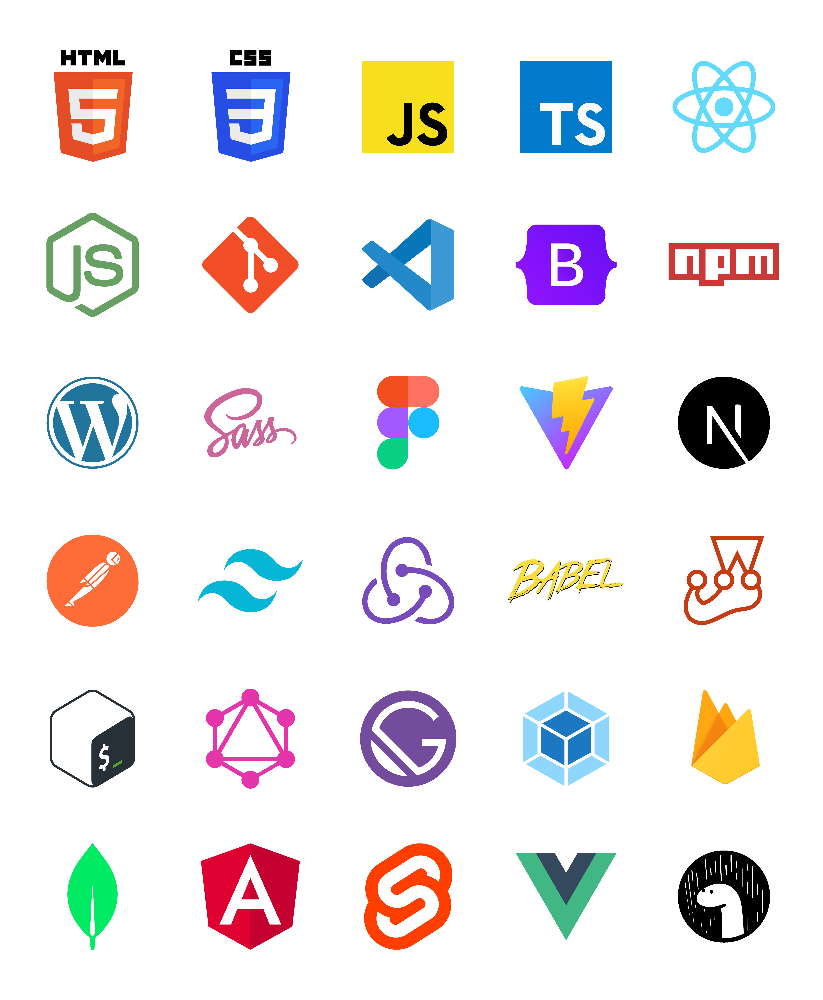

# Assets by creativoma

These assets are free resources to use on your Github profile.

Download the .ai file with all or just the one you need in .svg format.

## To use in your "Readme.md", use the following link path structure.

```
https://cdn.rawgit.com/creativoma/assets-creativoma/main/language-and-tools-logos/export-svg/angular.svg
```

## Screenshot




## Created by

- Github - [creativoma](https://github.com/creativoma)
- Linkedin - [in/ma-marianoalvarez/](https://www.linkedin.com/in/ma-marianoalvarez/)
